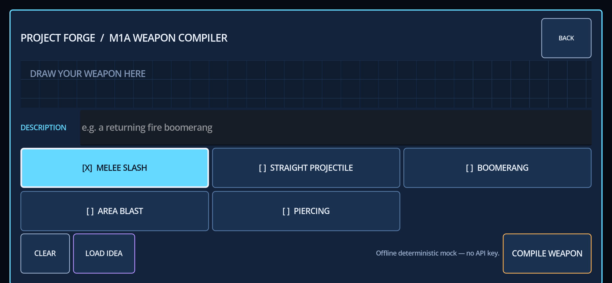
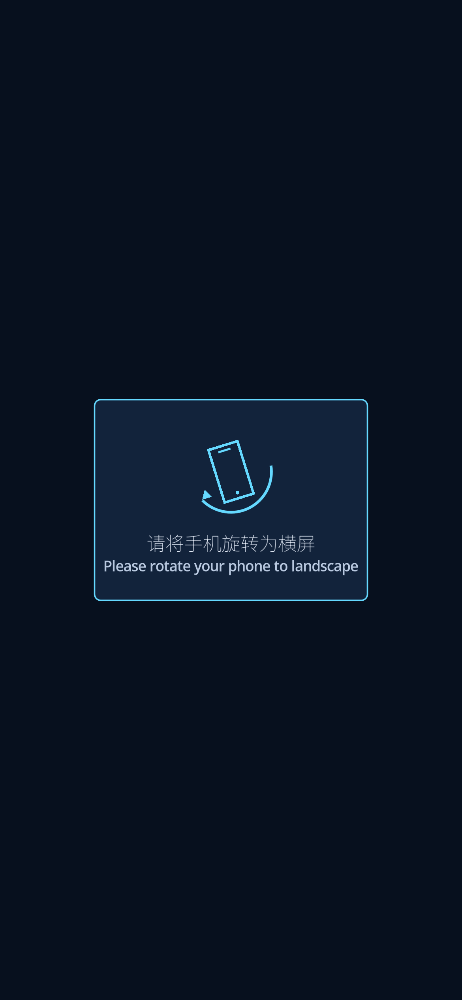
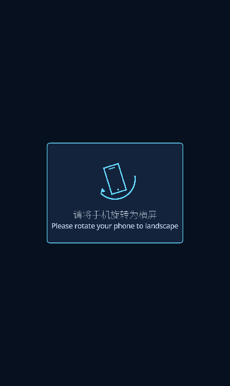
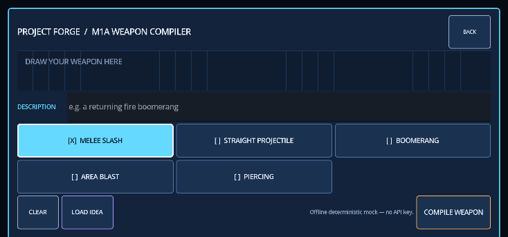
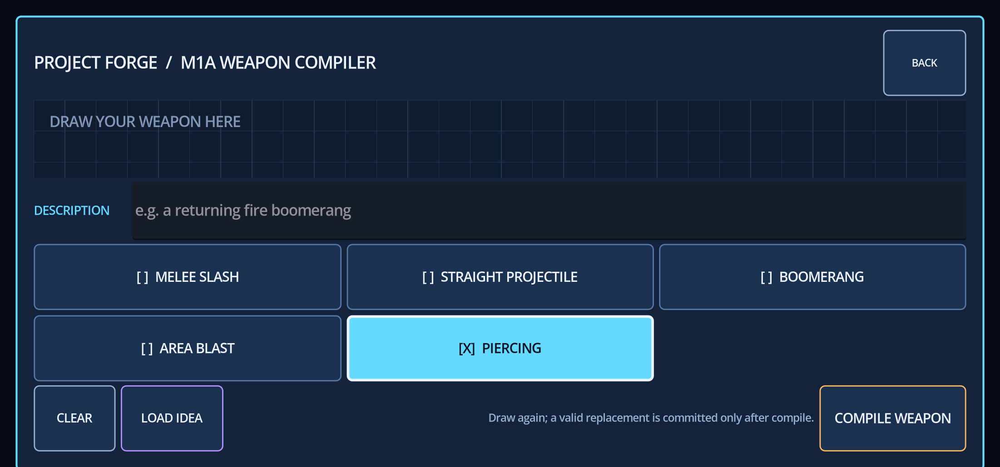
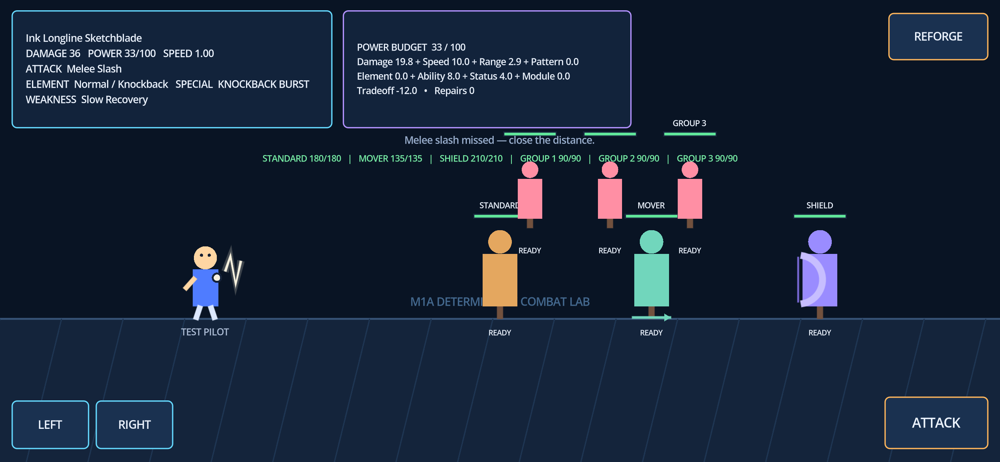
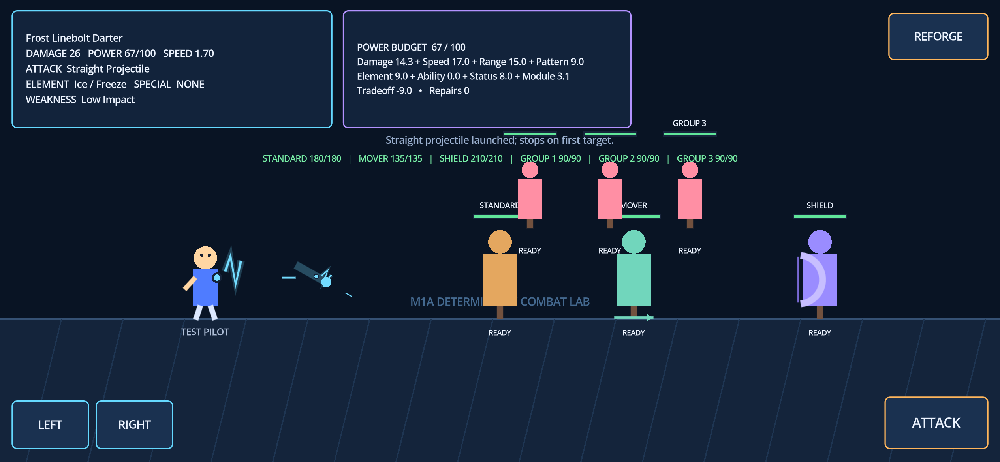
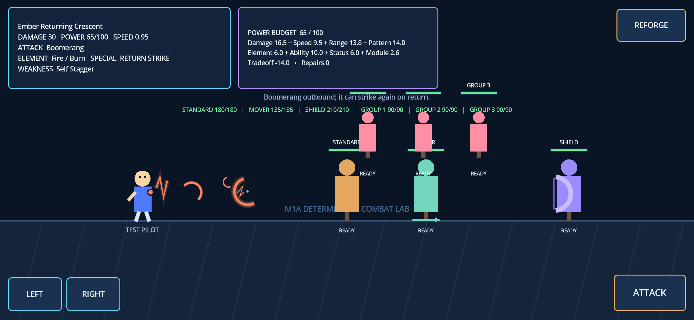
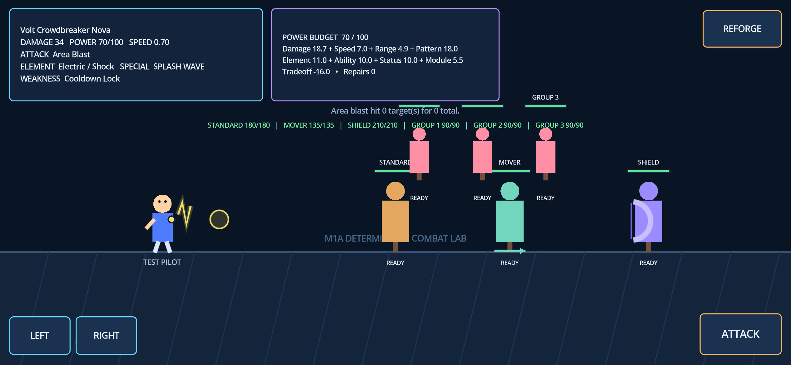
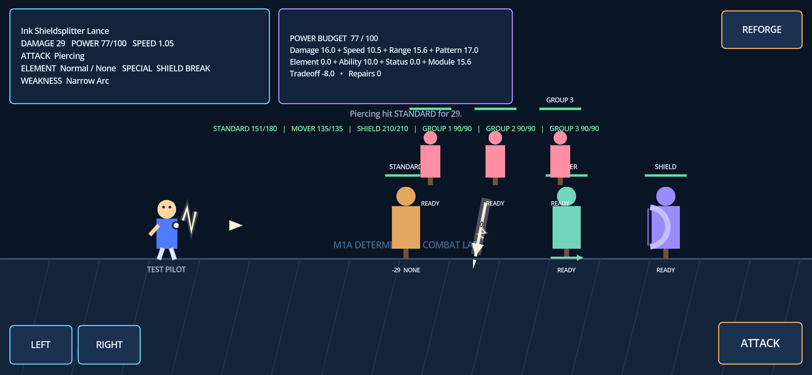

# iPhone Safari Touch/Layout Fix Results

Run date: 2026-07-19 (Australia/Sydney)  
Published source: `b403d9e9f0add5a6b069080a804cf76a200e6e45`
Branch: `codex/fix/iphone-safari-touch-layout`  
Milestone status: **TO VALIDATE — replacement deployment is live and automated checks pass; physical iPhone Safari remains the user acceptance gate**

## Root cause

The forge used a Godot `OptionButton`. Its `PopupMenu` opened as a modal popup on
physical iPhone Safari but did not complete item selection or outside dismissal,
so the popup retained the page-wide touch grab. The forge also had a full-screen
`ColorRect` using `MOUSE_FILTER_STOP`, and the project used an expanding logical
viewport without a portrait-specific UI. In portrait this stretched the 1280×720
compiler into a very tall canvas and pushed the popup over the bottom controls.

## Implemented fix

- Removed the `OptionButton`/`PopupMenu` path completely.
- Added five persistent 3+2 `ButtonGroup`-equivalent controls with release-based
  `pressed` handling, one selected item, `[X]` marker, distinct selected colors,
  border, and text color.
- Set each mode target to 102 logical pixels: about 55 CSS pixels at 844×390 and
  48 CSS pixels in the WebKit iPhone 15 landscape visual viewport (734×343 after
  simulated Safari chrome).
- Made `LOAD IDEA` and compile use the current M1A override and record
  `forced_attack_pattern` in the compiler audit.
- Limited `DrawingCanvas` consumption to its own rectangle and removed the
  main scene's global unhandled-input processing.
- Changed visual overlays/labels to `IGNORE`, routing containers to `PASS`, and
  actual controls to bounded `STOP` with release-triggered actions.
- Added a reversible bilingual portrait overlay with a vector rotation icon and
  a small OFL Noto Sans SC subset so the Chinese message renders in Web exports.
- Kept the selector in the forge only. Combat still exposes movement, attack,
  and REFORGE; M1B player-facing generation will infer the attack pattern.

## Automated results

| Check | Result |
| --- | --- |
| Godot import/GDScript parse | **PASS** |
| Deterministic matrix | **PASS — 32/32** |
| Godot assertions | **PASS — 414/414** |
| Main scene headless smoke | **PASS** |
| Static hosting worker | **PASS — 3/3** |
| WASM chunk loader | **PASS — 1/1** |
| Web export | **PASS** |
| GitHub Push + PR CI | **PASS** — both runs green at published source |
| Public deployment HTTP and asset identity | **PASS** — Sites v8, HTTP 200, new PCK/WASM chunk hashes |
| Chromium true-touch drawing and 30 selector switches | **PASS** |
| Chromium five LOAD IDEA → compile → attack → REFORGE cycles | **PASS** |
| Chromium 844×390, 852×393, 915×412 and three rotation cycles | **PASS; no scroll** |
| Chromium console | **PASS — 0 errors, 0 warnings** |
| Fresh WebKit iPhone 15 landscape, 734×343, 30 selector switches | **PASS** |
| Fresh WebKit five LOAD IDEA → compile → attack → REFORGE cycles | **PASS** |
| Physical iPhone Safari | **TO VALIDATE — user acceptance gate** |

Every Chromium and fresh-context WebKit compile produced a runtime-valid audit
whose `forced_attack_pattern` and `weapon_spec.attack_pattern` matched the selected
mode. The five loaded descriptions also matched their deterministic examples.

WebKit's Playwright port emits one `WEBGL_polygon_mode` warning and 16 repeated
`glBlitFramebuffer` validation errors. The same messages existed in the old-build
baseline. A fresh iPhone landscape context remains visible and completes the full
touch flow. Forcing portrait/landscape sizes inside one Playwright WebKit mobile
context can make screenshot readback black even though Godot continues processing
the touch/compile chain; this is recorded as a simulator limitation, not treated as
physical Safari acceptance.

## Build identity

- `index.pck`: 81,404 bytes
- `index.pck` SHA-256: `806B6E27A86E9B97F53A67D5C2A60ACB9A56A07B1D077A02E46F869815CCD9BB`
- `index.wasm`: 39,513,091 bytes
- `index.wasm` SHA-256: `35116F68540AC41ACF7D71EA457ADDED91B5E960A9CCA3E2ACC72918EAF01277`

The public Sites v8 deployment now serves these new bytes. A direct no-query
download of `/index.pck` returned HTTP 200 and the exact PCK hash above. Its two public WASM
chunks also match the frozen build: part 0 is 20,971,520 bytes with SHA-256
`C275B33C7A910B2CC899BDB23DAF5F6636F120850EDC6EDCBAC341403DF7EB5B`;
part 1 is 18,541,571 bytes with SHA-256
`18646FB4D2C6B6FD2D6E90173B1E2904B501D2F1D33CC94710FCE6D3D1DB9CC4`.
This is a real resource replacement, not a query-string-only cache workaround.

## Screenshots

### Chromium 844×390 forge

### Portrait rotate prompt

Fresh WebKit portrait also shows an opaque background; the stretched forge is not
visible beneath the prompt.

### WebKit iPhone 15 landscape with simulated Safari chrome (734×343)

### WebKit selector after five compile/attack/REFORGE cycles

### Chromium attack evidence

## Delivery gate

The private GitHub repository is
<https://github.com/olliebigbang/project-forge>. Draft PR #1 is
<https://github.com/olliebigbang/project-forge/pull/1>. Push and pull-request CI
both pass at the published source. The branch remains unmerged as required.

Public acceptance build:
<https://project-forge-weapon-lab.hongningliu0130.chatgpt.site/?release=v8-b403d9e>

The stable hostname is unchanged, but Sites version 8 and the underlying PCK/WASM
resources are new. Public Chromium regression passed all five compile/attack cycles,
30 selector switches, three rotation cycles, the 844×390, 852×393, and 915×412
layout matrix, and produced zero console errors or warnings. Public WebKit iPhone
15 landscape regression passed the same five functional cycles and 30 selector
switches at a 734×343 visual viewport with no scroll.

The downloadable fallback remains
`release/Project-Forge-M1A-iPhone-Touch-Fix-Web.zip`. It contains the exact Web
export, a local Node HTTP server, launch instructions, and a build identity file.
Archive SHA-256: `045AC90A37641110E61D9D425CA89E8876B38965AC4E50DF3D4FF7A309E51E76`.

## Physical iPhone acceptance checklist

1. Open the new deployment in Safari in portrait; confirm only the bilingual
   rotate prompt is shown.
2. Rotate to landscape without refreshing; confirm the prompt disappears and all
   forge controls are visible above Safari chrome.
3. Tap the five modes forward and backward, then switch repeatedly; confirm one
   `[X]` selection and no modal or lock.
4. Draw, clear, draw again, edit the description with the iOS keyboard, close the
   keyboard, and confirm the layout returns.
5. For each mode, use LOAD IDEA, compile, attack, REFORGE, and continue selecting.
6. Use BACK after returning to the forge, then REFORGE again.
7. Rotate portrait → landscape → portrait → landscape at least three times without
   refreshing and confirm touch remains responsive.
