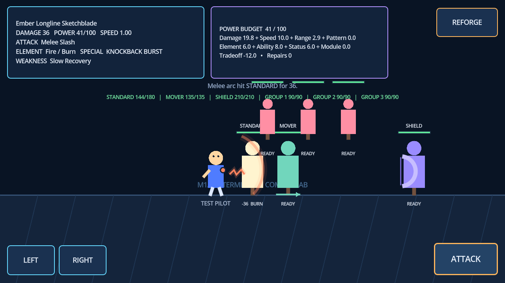
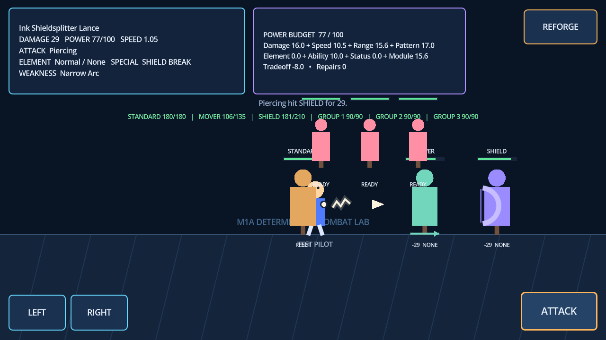
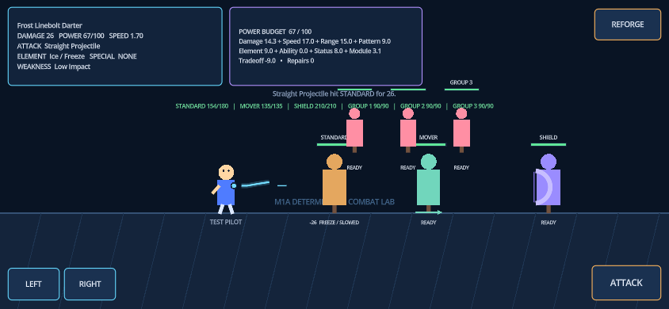
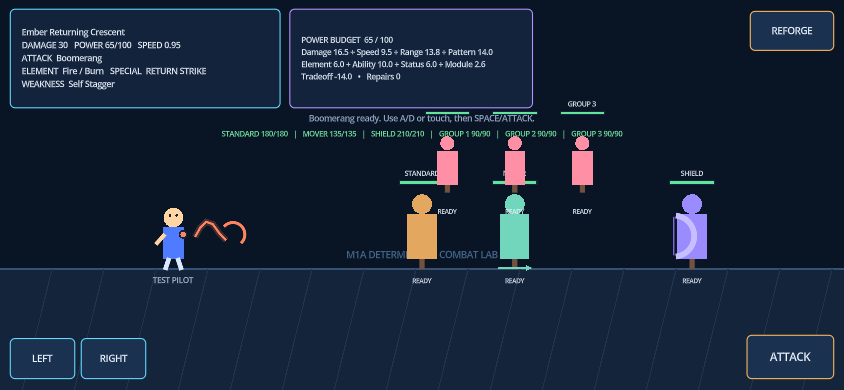
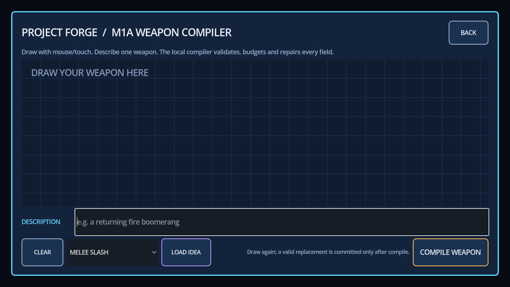
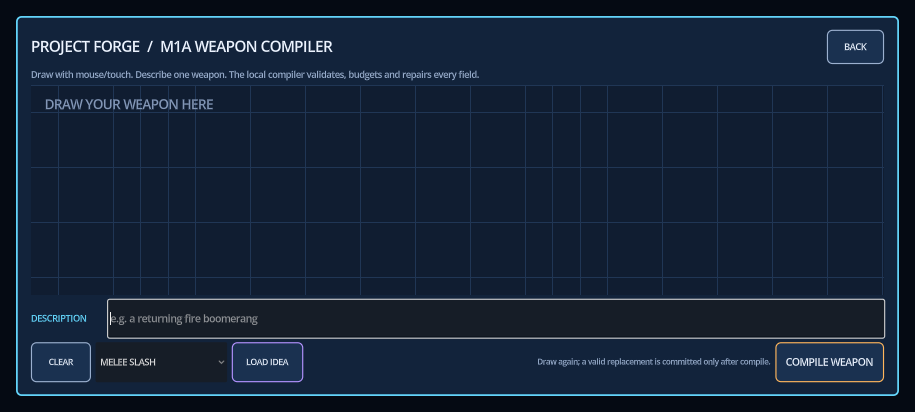

# Project Forge M1A Test Results

> **Superseded acceptance status (2026-07-19):** the v7 public build documented
> below fails the physical iPhone Safari attack-selector flow. M1A is reopened and
> remains **TO VALIDATE** until the replacement touch fix is deployed and accepted
> on the user's real device. See `artifacts/IPHONE_SAFARI_FIX_RESULTS.md`.

Run date: 2026-07-19 (Australia/Sydney)  
Engine: Godot 4.7.1 stable, GL Compatibility renderer  
Public deployment: Sites version 7, production publish  
URL: https://project-forge-weapon-lab.hongningliu0130.chatgpt.site

## Summary

| Check | Result | Evidence |
| --- | --- | --- |
| Deterministic input matrix | **PASS — 32/32** | `tests/m1a_input_matrix.json` |
| Godot assertions | **PASS — 347/347** | `./scripts/test.ps1` |
| Fresh-worktree import then tests | **PASS** | QA removed `.godot`; first command succeeded |
| JSON Schema/runtime parity | **PASS** | Same 16 fields, five attacks, four elements |
| Illegal/missing/extreme repair | **PASS** | Non-finite, bounds, enums, extra fields, empty object |
| Explicit power budget | **PASS** | Component sum invariant; extreme inputs repaired to ≤100 |
| Strong-capability tradeoff | **PASS** | Matrix invariant; no strong spec retains `drawback: none` |
| Godot import and GDScript parse | **PASS** | Headless editor import |
| Main-scene smoke | **PASS** | 120 iterations, no runtime error |
| Static hosting worker | **PASS — 3/3** | Isolation, cache revalidation, HTML no-store intent |
| WASM chunk loader | **PASS — 1/1** | Ordered byte reconstruction and WASM magic |
| Release Web export | **PASS** | HTML/JS/WASM/PCK generated |
| Public deployment | **PASS** | Production publish succeeded; HTTP 200 |
| Public browser console | **PASS** | 0 errors, 0 warnings |
| Five attack behaviors | **PASS** | Public Chromium combat runs |
| 844×390 touch flow | **PASS** | Draw, compile, held movement, attack, re-forge |
| 915×412 layout | **PASS** | All creation controls visible and usable |

The complete spec, budget, correction, fallback, and pass/fail records are in
`artifacts/m1a_acceptance_results.json`. Runtime sessions additionally append JSONL
records to Godot's `user://m1a_generation_log.jsonl`.

## Attack and target evidence

| Attack | Observed public behavior |
| --- | --- |
| `melee_slash` | Fire arc hit STANDARD for 36; burn ticks followed |
| `straight_projectile` | Cyan bolt stopped on first target for 26 and applied freeze/slow |
| `boomerang` | Ember crescent travelled outbound, reversed, and reported return-path hits |
| `area_blast` | Electric expanding ring hit three targets for 102 total and applied stagger |
| `piercing` | Lance continued through MOVER and SHIELD for 29 each; shield reduction was bypassed |

The target lab contains one stationary target, one moving target, one frontal
shield target, and three grouped targets. Automated rules separately verify that
a frontal straight projectile is reduced from 50 to 10 while piercing remains 50.

## Public browser evidence

The final v7 deployment returned HTTP 200 for HTML, JS, PCK, both WASM chunks,
and the chunk loader. Its public `index.pck` was 107,692 bytes with SHA-256
`1A40F507D01BD9AAD65C4C58C7A7B025A4FC1F2D1186E878BD7F294685914002`, exactly
matching the local final export; fresh Chromium reported zero errors and warnings.

### Melee hit after reach regression fix

### Piercing bypasses the shield and continues through targets

### True touch events at 844×390

The test used Chromium CDP `touchStart` / `touchMove` / `touchEnd` for drawing,
compile, held movement, attack, and re-forge. The captured projectile is the
player's normalized stroke geometry.

### Re-forge combat isolation

The final v7 regression launched a fire boomerang, opened re-forge after 50 ms,
waited, and returned. Every target retained full health and the ready status was
not overwritten by an old hit.

### Public re-forge state

### 915×412 landscape layout

## Defects found and closed during regression

| Severity | Finding | Resolution |
| --- | --- | --- |
| P1 | Fresh worktree ran unit tests before Godot import, so `class_name` cache was absent | `scripts/test.ps1` now imports/parses first; QA repeated from no `.godot` and passed |
| P1 | An extreme spec could receive cosmetic drawback credit while its real component sum stayed above 100 | Drawbacks now enforce their semantic cost, the reducer uses the recalculated total, and score/runtime validity must match that total; hostile and contradictory-input regressions added |
| P1 | Visible melee reach could overlap a target while the hit gate rejected it | Reach now includes the rendered hand/stroke/arc extent; public fresh-context hit confirmed |
| P2 | Re-forging could leave the previous weapon's cooldown on the replacement | `ForgePlayer.equip()` resets cooldown; drawback multipliers still apply after attack |
| P2 | An outbound boomerang or pending status tick could continue while the re-forge overlay was open | Re-forge now gates combat, removes transient attacks, and cancels pending target statuses before accepting new input |
| P2 | Stable Godot filenames could retain an old PCK for one hour after an in-place deployment | Runtime assets now require revalidation; automated worker tests cover the policy |

## Downloadable Web build

`release/Project-Forge-M1A-Web.zip` contains the raw Web export, a local HTTP
server, `START_WEB.ps1`, and instructions. Archive size is approximately 10.3 MB;
the uncompressed WebAssembly payload is approximately 39.5 MB. SHA-256:
`53B8A6FB64CD5BB403A3F781CED6DF6FCAD02509FC25D3D4EDFF06B592AE986A`.

## Known limitations

- The compiler is a deterministic keyword interpreter, not a semantic image or
  language model. Drawing geometry affects naming/visual shape, not deep intent.
- Browser tests emulate phone landscape and direct touch events; no physical iOS
  or Android GPU, safe-area, thermal, backgrounding, or virtual-keyboard matrix has
  been run. A real mobile keyboard remains **TO VALIDATE**.
- Fire burn, ice slow, and electric stagger are intentionally small prototype
  effects; production tuning and accessibility feedback remain **TBD**.
- The target lab and hand-drawn visuals are technical placeholders, not a level or
  formal art. There is no player health, dodge, win/loss loop, boss, or progression.
- The runtime JSONL audit is stored in browser/Godot user storage and has no export
  UI. The checked-in matrix artifact is the shareable audit for this milestone.
- The hosting workaround splits the 39.5 MB WASM into two chunks. This is viable
  for the probe, but load size and low-end mobile performance remain **TO VALIDATE**.
- No normal Git remote is configured, so there is no GitHub/GitLab PR. The source
  was pushed only to the hosting project's internal repository for deployment.

## Recommendation

**Do not proceed to M1B yet.** The deterministic compiler and local replacement
touch flow pass automated checks, but the reopened physical iPhone Safari gate and
replacement public deployment must be accepted first. Paid AI remains deferred.
