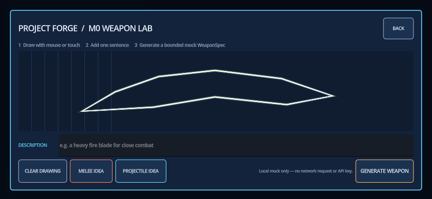
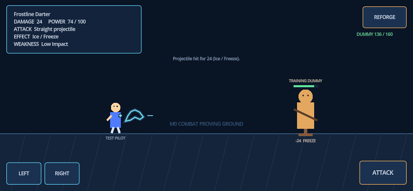
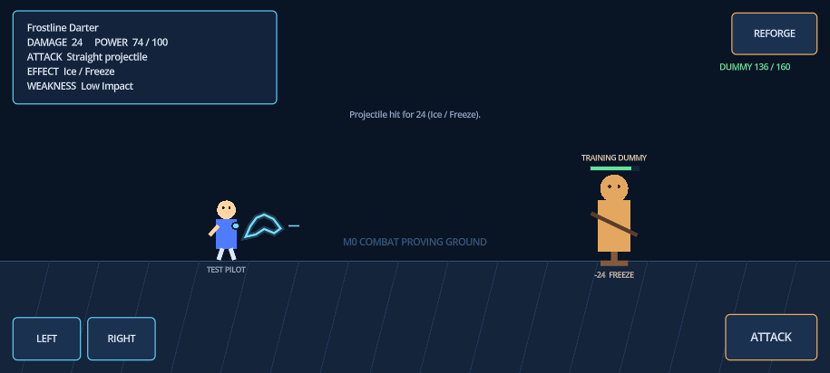
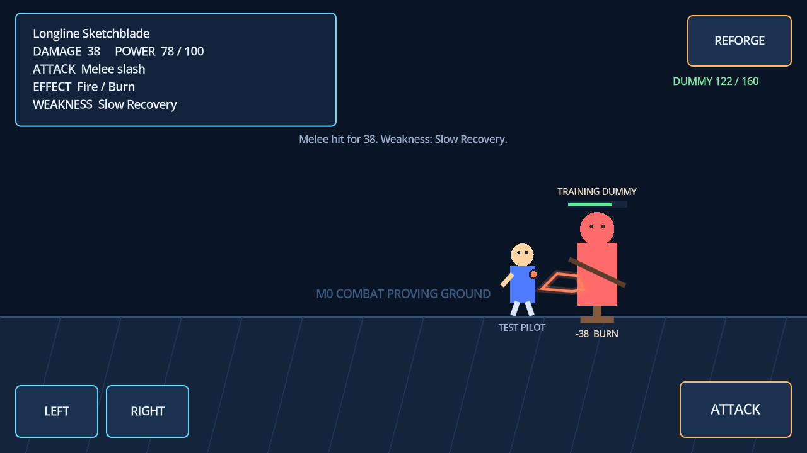
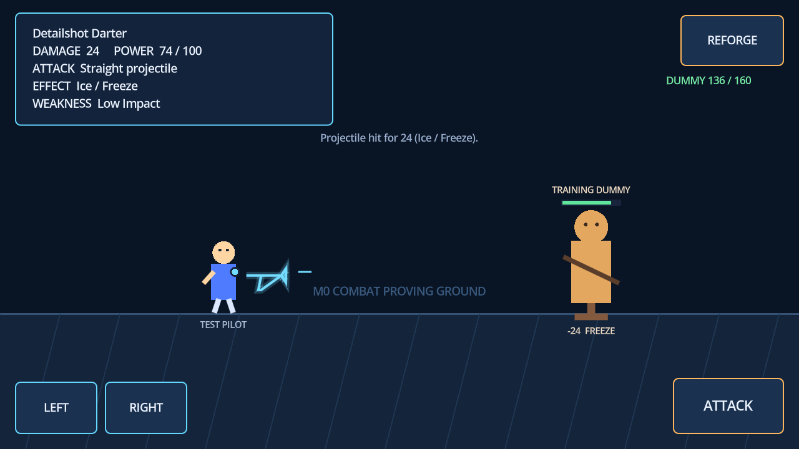
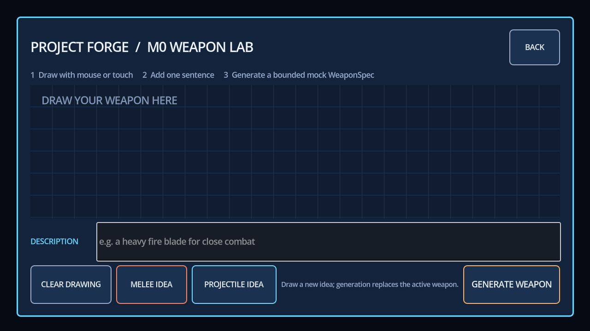

# Project Forge M0 Test Results

Run date: 2026-07-19 (Australia/Sydney)  
Engine: Godot 4.7.1 stable, GL Compatibility renderer  
Browser target: Chromium, Godot Web single-threaded export

## Summary

| Check | Result | Evidence |
| --- | --- | --- |
| Deterministic unit suite | **PASS — 37/37** | `./scripts/test.ps1` |
| Godot import and GDScript parse | **PASS** | Godot `--editor --import` |
| Headless main-scene smoke | **PASS** | 120 iterations, no runtime error |
| Release Web export | **PASS** | HTML, JS, WASM, PCK, icons generated |
| HTTP load | **PASS** | Local server returned HTTP 200 |
| Browser console | **PASS** | 0 errors, 0 warnings |
| Desktop interaction | **PASS** | Draw, melee hit, re-forge, projectile hit |
| True touch event path | **PASS** | Chromium CDP touch start/move/end drove Godot canvas and buttons |
| 1280×720 layout | **PASS** | No clipping; all controls visible |
| 844×390 layout | **PASS** | Approx. 44px touch targets; touch draw/generate/attack hit |
| 915×412 layout | **PASS** | No clipping; combat controls remain usable |
| Secret scan | **PASS** | No credential assignment found; mock needs no key |

## Unit coverage

The 37 assertions cover:

- `WeaponSpec` name length, allow-list fallback, numeric clamping, M0 attack
  degradation, validation, and dictionary round-trip.
- Deterministic melee selection, projectile selection, fire/burn, ice/freeze, range,
  blank-input fallback, blocked-input fallback, and logged failure reasons.
- Drawing stroke/point count, aspect ratio, and coverage summary.
- JSON Schema readability, parsing, and all 12 required contract fields.

## Browser evidence

### Touch drawing at 844×390

### Touch-generated projectile hit at 844×390

### Layout at 915×412

### Desktop melee hit

### Desktop projectile in flight and hit

### Re-forging clears the creation state

## Web artifact

The generated build is under `build/web/` and is intentionally Git-ignored except
for its placeholder. The final export includes approximately:

- `index.wasm`: 39.5 MB
- `index.js`: 280 KB
- `index.pck`: 40 KB
- `index.html`: 5.5 KB

Serve it over HTTP using `./scripts/serve_web.ps1`; direct `file://` loading is not
supported for the WebAssembly build.

## Known limitations

- **CONFIRMED M0 scope:** only melee slash and straight projectile are executable.
  Boomerang, area blast, piercing, four-element balancing, active abilities, dodge,
  player health, formal win/loss, levels, monsters, and Boss remain M1/M2 work.
- The local mock is a deterministic keyword mapper, not a real language/vision
  model. It performs only a small safety fallback and is not production moderation.
- The M0 drawing summary uses geometry statistics; it does not semantically analyze
  an image. Strokes are normalized and recolored without production smoothing,
  grip inference, material generation, or animation authoring.
- Browser checks use Chromium emulation and direct touch events, not physical iOS or
  Android hardware. Notches, native safe-area APIs, mobile GPU performance,
  backgrounding, and virtual-keyboard behavior remain M3 device tests.
- There is no secure backend, networking, cache, persistence, cost telemetry, or
  public hosting. This is deliberate; no secret or paid API is present.
- UI copy and placeholder art are English-only and intentionally utilitarian.
- Combat has one stationary dummy with automatic reset, not a formal level or
  complete game loop.

## Recommendation

Proceed to M1 weapon compiler work. M0 did not reveal an engine, Web, touch,
rendering, or data-contract blocker. M1 should stay deterministic until five attack
modules, four elements, power-budget enforcement, fallback cases, and the 20-input
acceptance matrix pass; only then evaluate a real AI backend.

