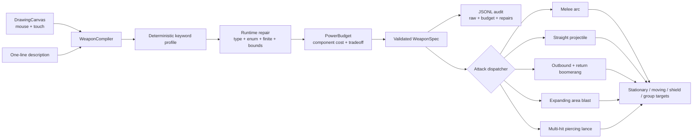

# Project Forge Architecture

## Scope and principles

- **CONFIRMED** Godot 4.7.1, GDScript, 2D landscape, Web-first prototype.
- **CONFIRMED** Player intent crosses a structured-data boundary; model output can
  never introduce executable game code.
- **CONFIRMED** M1A remains offline and deterministic. No paid API or secret exists
  in the client.
- **CONFIRMED** Gameplay consumes only a repaired, runtime-valid `WeaponSpec` whose
  calculated power does not exceed 100.
- **CONFIRMED** The generated visual preserves the player's stroke geometry.

## M1A runtime flow



## Contract and double validation

`schema/weapon_spec.schema.json` is the portable Draft 2020-12 contract.
`WeaponSpec.repair_dict()` is the runtime boundary. Automated parity tests require
the same 16 fields, five attack enums, and four element enums in both layers.

Runtime repair handles missing values, wrong types, unsupported enums, non-finite
numbers, numeric bounds, class/pattern mismatches, overlong names, and unknown
fields. Repairs never mutate executable behavior outside the allow-list and every
reason is retained in `WeaponSpec.corrections`.

## Explicit power budget

`PowerBudget.calculate()` records separate costs for damage, attack speed, range,
attack pattern, element, special ability, status effect, projectile speed, area
radius, and pierce count. The drawback is a negative credit. The sum is shown in
the HUD and stored with the generation audit.

`PowerBudget.balance()` performs deterministic correction in this order:

1. Repair the raw contract.
2. Add a pattern-appropriate drawback if a strong capability has none.
3. Reduce damage, then attack speed, then range when still over 100.
4. Apply `cooldown_lock` and a final damage clamp only if required.

The runtime executes recovery-related drawbacks as longer attack cooldowns.
`low_impact`, `narrow_arc`, and projectile tradeoffs are expressed in profile
statistics and module geometry.

## Attack and element behavior

| Module | Visible and combat distinction |
| --- | --- |
| `melee_slash` | Short-lived arc; closest forward target only; requires proximity |
| `straight_projectile` | Fast linear bolt; stops at first body |
| `boomerang` | Rotating crescent; reverses and may hit again on return |
| `area_blast` | Expanding double ring; damages every target in radius |
| `piercing` | Narrow lance; continues through bodies up to `pierce_count`; bypasses shields |

| Element | Palette | Runtime behavior |
| --- | --- | --- |
| `normal` | Ink/ivory | No elemental modifier |
| `fire` | Ember orange | Two delayed burn ticks |
| `ice` | Cyan | Temporarily slows moving targets |
| `electric` | Yellow | Temporarily staggers moving targets |

## Source layout

```text
scripts/weapon_compiler.gd  deterministic input interpreter and audit
scripts/weapon_spec.gd      contract repair, runtime validation, display
scripts/power_budget.gd     explicit calculator and deterministic balancing
scripts/main.gd             UI, target lab, attack dispatch
scripts/projectile.gd       straight, boomerang, and piercing behaviors
scripts/area_blast.gd       radius-based multi-target attack
scripts/slash_effect.gd     melee attack feedback
scripts/training_dummy.gd   stationary/moving/shield/group target rules
schema/                     portable JSON Schema
tests/                      32-case matrix and headless checks
hosting/                    public static worker and WASM chunk loader
```

## Hosting boundary

Godot's WebAssembly file is larger than the hosting service's single-file limit.
`scripts/build_sites_preview.ps1` splits it into two ordered chunks and injects a
small browser loader that reconstructs the exact bytes before Godot compilation.
Node tests verify chunk order and WebAssembly magic bytes. The hosting worker adds
COOP/COEP/CORP and cache headers.

- **TO VALIDATE** Physical iOS/Android safe areas, virtual keyboards, thermal/GPU
  performance, and browser-specific audio remain device-stage work.
- **TBD** Any future real-model backend, provider, authentication, moderation,
telemetry, cost controls, retention, and privacy policy.

## Mobile Web presentation and input boundary

- **CONFIRMED** `MobileLayoutPolicy` selects Compact Landscape from the current
  CSS `visualViewport`, not the 1280×720 Godot logical viewport. It recalculates
  after orientation, window, visual viewport resize, and Safari toolbar changes.
- **CONFIRMED** `WebMobileBridge` owns exactly one bounded DOM text-input overlay
  aligned to the Godot Description row. It never covers the drawing canvas,
  attack-mode buttons, action buttons, combat screen, or portrait rotation gate.
- **CONFIRMED** DOM `input`, focus, blur, and clear events synchronize into the
  Godot `LineEdit`; Godot `LOAD IDEA`, RESET, re-forge, and compile synchronize
  back to the DOM value. Compilation always pulls the latest DOM value first.
- **CONFIRMED** iOS/Android native exports continue to use Godot `LineEdit`.
  Only Web uses the HTML overlay needed for dependable mobile keyboard focus.
- **TO VALIDATE** Physical iPhone Safari still owns the final keyboard, safe-area,
  and toolbar acceptance because desktop WebKit emulation cannot display or prove
  the real system keyboard.
