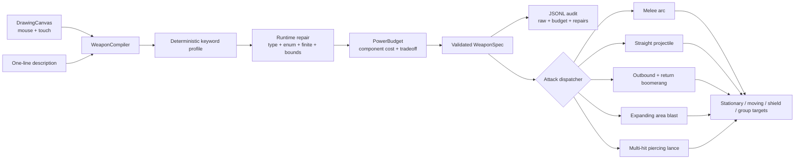

# Project Forge Architecture

## Scope and principles

- **CONFIRMED** Godot 4.7.1, GDScript, 2D landscape, Web-first prototype.
- **CONFIRMED** Player intent crosses a structured-data boundary; model output can
  never introduce executable game code.
- **CONFIRMED** Stable M1A remains offline and deterministic. M1B1 adds a
  same-origin server boundary; no paid API or secret exists in the Godot client,
  browser assets, repository, or logs.
- **CONFIRMED** Gameplay consumes only a repaired, runtime-valid `WeaponSpec` whose
  calculated power does not exceed 100.
- **CONFIRMED** The generated visual preserves the player's stroke geometry.

## M1A runtime flow



## M1B1 text interpretation flow

```mermaid
flowchart LR
    D["Drawing summary\ncounts + aspect + coverage"] --> G["Godot WeaponInterpreter"]
    T["Free text + locale + request_id"] --> G
    G -->|"POST /api/compile-weapon\nsame origin only"| W["Sites server worker"]
    W --> Q["Type/byte limits + safety rules"]
    Q --> L["Sites D1\nquota + request ledger"]
    L --> A["Provider adapter\nreal provider TBD"]
    A --> S["Structured semantic labels"]
    S --> R["Server schema + allow-list repair"]
    R --> P["Deterministic PowerBudget"]
    P --> C["Privacy-safe response + audit metadata"]
    C --> V["Godot revalidation + rebalance"]
    V --> U["Confirmation / MODIFY / TRY AGAIN"]
    U --> X["Existing five attack modules"]
```



- **CONFIRMED** The model is data-only and semantic-first. Provider numeric
  output is untrusted; executable numbers come from project-owned deterministic
  profiles and balancing.
- **CONFIRMED** The current adapter is deterministic until a provider/model is
  selected. It exercises the complete transport and safety boundary but is not
  evidence of real-AI quality, latency, or cost.
- **CONFIRMED** At most one request is active. The client creates cryptographically
  random 128-bit session and request IDs. On Sites, an atomic D1 request ledger
  gives identical concurrent requests one owner across worker isolates; completed
  results replay inside a caller namespace. The local deterministic server uses
  an in-process Promise map only as a development fallback.
- **CONFIRMED** Each HTTP node binds the initiating revision and request ID. The
  client requires the response ID to match before any state change, so a cancelled
  request A cannot commit after request B starts.
- **CONFIRMED** Provider free-form names, summaries, correction text, metadata,
  and nested cost objects are not reflected. Display names/summaries and repair
  messages are generated from allow-listed labels; cost is exactly `UNKNOWN` or a
  bounded `{amount, currency: "USD"}` object.
- **CONFIRMED** The worker requires `X-Forge-Session`. Sites D1 atomically limits
  a session to 8 requests/minute and a network to 60 requests/minute across
  isolates, returning 429 plus `Retry-After`; it fails closed before provider
  invocation if the bound request guard is unavailable. A provider account spend
  cap remains mandatory before paid public traffic.
- **CONFIRMED** Every provider call receives an `AbortSignal`. A wrapper timeout
  aborts cooperative transports but is never automatically retried because the
  backend cannot prove that an upstream request was unbilled. One retry is allowed
  only when an adapter explicitly classifies a transient failure as retry-safe.
- **CONFIRMED** Cancellation invalidates late responses, and every terminal
  failure returns a fully validated fallback without discarding strokes or text.
- **CONFIRMED** Normal players never preselect an attack mode. Five buttons exist
  only in Developer/Test Mode or the explicit MODIFY flow, where every change is
  recompiled and revalidated before confirmation.
- **CONFIRMED** M1B1 sends bounded drawing metadata only; image/vision semantics
  are reserved for M1B2.

## Contract and double validation

`schema/weapon_spec.schema.json` is the portable Draft 2020-12 contract.
`WeaponSpec.repair_dict()` is the runtime boundary. Automated parity tests require
the same 16 fields, five attack enums, and four element enums in both layers.

Runtime repair handles missing values, wrong types, unsupported enums, non-finite
numbers, numeric bounds, class/pattern mismatches, overlong names, and unknown
fields. Repairs never mutate executable behavior outside the allow-list and every
reason is retained in `WeaponSpec.corrections`.

## Explicit power budget

`PowerBudget.calculate()` records separate costs for damage, attack speed, range,
attack pattern, element, special ability, status effect, projectile speed, area
radius, pierce count, and boomerang return speed. The drawback is a negative credit. The sum is shown in
the HUD and stored with the generation audit.

`PowerBudget.balance()` performs deterministic correction in this order:

1. Repair the raw contract.
2. Remove pattern/element-incompatible abilities, statuses, materials, and
   inapplicable drawback credits.
3. Add a pattern-appropriate drawback if a strong capability has none.
4. Reduce damage, attack speed, range, and module-specific values when still over
   100.
5. Apply `cooldown_lock` and a final damage clamp only if required.

The runtime executes recovery-related drawbacks as longer attack cooldowns.
`low_impact`, `narrow_arc`, and projectile tradeoffs are expressed in profile
statistics and module geometry.

## Attack and element behavior

| Module | Visible and combat distinction |
| --- | --- |
| `melee_slash` | Short-lived arc; closest forward target only; requires proximity |
| `straight_projectile` | Fast linear bolt; stops at first body |
| `boomerang` | Rotating crescent; reverses and may hit again on return |
| `area_blast` | Expanding double ring; damages every target in radius |
| `piercing` | Narrow lance; continues through bodies up to `pierce_count`; bypasses shields |

| Element | Palette | Runtime behavior |
| --- | --- | --- |
| `normal` | Ink/ivory | No elemental modifier |
| `fire` | Ember orange | Two delayed burn ticks |
| `ice` | Cyan | Temporarily slows moving targets |
| `electric` | Yellow | Temporarily staggers moving targets |

## Source layout

```text
scripts/weapon_compiler.gd  deterministic input interpreter and audit
scripts/weapon_interpreter.gd same-origin async client, cancellation, fallback
scripts/weapon_spec.gd      contract repair, runtime validation, display
scripts/power_budget.gd     explicit calculator and deterministic balancing
scripts/main.gd             UI, target lab, attack dispatch
scripts/projectile.gd       straight, boomerang, and piercing behaviors
scripts/area_blast.gd       radius-based multi-target attack
scripts/slash_effect.gd     melee attack feedback
scripts/training_dummy.gd   stationary/moving/shield/group target rules
schema/                     portable JSON Schema
tests/                      M1A matrix, 48 M1B1 cases, red-team/browser checks
hosting/weapon_interpreter.mjs request/safety/provider orchestration
hosting/durable_request_guard.mjs D1 quota, lease, replay, and cleanup
hosting/weapon_contract.mjs server repair and power-budget parity
hosting/weapon_schema.mjs   executable Draft 2020-12 schema validation
hosting/static_worker.mjs   static hosting, API route, and WASM chunk loader
db/ + drizzle/              Sites D1 schema and migration evidence
```

## Hosting boundary

Godot's WebAssembly file is larger than the hosting service's single-file limit.
`scripts/build_sites_preview.ps1` splits it into two ordered chunks and injects a
small browser loader that reconstructs the exact bytes before Godot compilation.
Node tests verify chunk order and WebAssembly magic bytes. The hosting worker adds
COOP/COEP/CORP and cache headers and owns `POST /api/compile-weapon`.

- **CONFIRMED (capability)** Sites supports server worker functions, a logical D1
  binding, and secret environment variables. D1 binding `DB` owns the short-lived
  quota/idempotency records; provider credentials will be configured as secrets
  and never injected into the Web build.
- **CONFIRMED** Audit logs contain request ID, input length, provider/model label,
  attempts, latency, fallback and correction counts, cost metadata, and validity;
  they omit raw descriptions, drawings, keys, and full provider responses.
- **TBD** Real provider/model and provider-specific secret. Options, current list
  pricing, environment names, and recommendation are recorded in
  `docs/M1B1_PROVIDER_DECISION.md`.
- **TBD** Provider-side moderation, production authentication, provider account
  spend cap, telemetry destination, and retention. The D1 rate window and request
  ledger are **CONFIRMED** in local SQLite/D1-parity tests and remain **TO
  VALIDATE** on the first real Sites deployment.

- **TO VALIDATE** Physical iOS/Android safe areas, virtual keyboards, thermal/GPU
  performance, and browser-specific audio remain device-stage work.
- **TO VALIDATE** Real-provider latency, P95, cost, rate-limit behavior, and public
  deployment remain unmeasured until provider configuration.

## Mobile Web presentation and input boundary

- **CONFIRMED** `MobileLayoutPolicy` selects Compact Landscape from the current
  CSS `visualViewport`, not the 1280×720 Godot logical viewport. It recalculates
  after orientation, window, visual viewport resize, and Safari toolbar changes.
- **CONFIRMED** `WebMobileBridge` owns exactly one bounded DOM text-input overlay
  aligned to the Godot Description row. It never covers the drawing canvas,
  attack-mode buttons, action buttons, combat screen, or portrait rotation gate.
- **CONFIRMED** DOM `input`, focus, blur, and clear events synchronize into the
  Godot `LineEdit`; Godot `LOAD IDEA`, RESET, re-forge, and compile synchronize
  back to the DOM value. Compilation always pulls the latest DOM value first.
- **CONFIRMED** iOS/Android native exports continue to use Godot `LineEdit`.
  Only Web uses the HTML overlay needed for dependable mobile keyboard focus.
- **TO VALIDATE** Physical iPhone Safari still owns the final keyboard, safe-area,
  and toolbar acceptance because desktop WebKit emulation cannot display or prove
  the real system keyboard.
