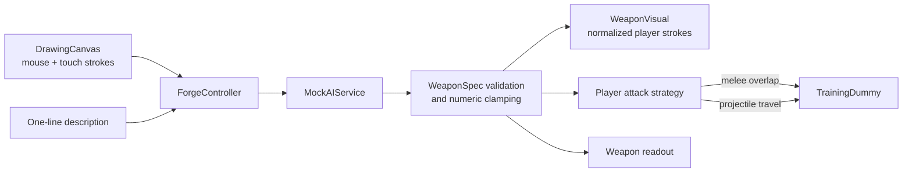

# Project Forge Architecture

## Scope and principles

- **CONFIRMED** Godot 4.7.1, GDScript, 2D landscape, Web-first technical probe.
- **CONFIRMED** Player intent crosses a structured data boundary; AI never returns
  executable game code.
- **CONFIRMED** M0 is offline and deterministic. A mock service stands in for the
  future secure backend.
- **CONFIRMED** Runtime systems consume only a validated, clamped `WeaponSpec`.
- **CONFIRMED** Rendering reuses the player's original stroke geometry.

## Runtime flow



## Source layout

```text
project.godot                  Godot project and viewport/input settings
scenes/main.tscn               Composition root
scripts/main.gd                UI/state orchestration
scripts/drawing_canvas.gd      Pointer/touch capture and stroke rendering
scripts/weapon_spec.gd         Canonical fields, validation, clamping, display
scripts/mock_ai_service.gd     Deterministic M0 interpreter/fallback
scripts/weapon_visual.gd       Stroke-preserving in-world rendering
scripts/player.gd              Movement and attack dispatch
scripts/projectile.gd          Straight projectile behavior
scripts/training_dummy.gd      Damage target and reset behavior
schema/weapon_spec.schema.json Portable contract for future backend
tests/                         Headless deterministic checks
scripts/*.ps1                  Run, test, build, and local Web serving
```

## `WeaponSpec` contract

Required M0 fields:

| Field | Type / bounds | M0 use |
| --- | --- | --- |
| `name` | non-empty string, max 48 chars | Weapon card |
| `weapon_class` | `melee` or `ranged` | Readout and strategy |
| `attack_pattern` | `melee_slash` or `straight_projectile` | Attack dispatch |
| `element` | `normal`, `fire`, `ice`, `electric` | Visual palette |
| `damage` | integer 1–100 | Dummy damage |
| `attack_speed` | float 0.2–3.0 attacks/sec | Cooldown |
| `range` | float 40–900 pixels | Hit reach / projectile life |
| `special_ability` | supported string | Readout; not activated in M0 |
| `status_effect` | supported string | Readout and light visual feedback |
| `drawback` | supported string | Weakness readout |
| `visual_material` | supported string | Palette hint |
| `power_score` | integer 1–100 | Budget/readout |

`WeaponSpec.from_dict()` owns coercion, allow-list fallback, and clamping. Both the
mock and a future network adapter must pass through it before gameplay.

## Service boundary

### M0

`MockAIService.generate(description, drawing_summary)` returns locally and
deterministically. Keywords select melee/projectile and element modules. Values are
chosen from fixed bounded profiles, not randomly re-rolled. This keeps tests stable
and prevents the prototype from rewarding repeated generation for raw stats.

### Target backend

```text
Godot client
  -> authenticated HTTPS endpoint
  -> input moderation
  -> model interpretation
  -> JSON Schema validation
  -> server-owned power-budget clamp
  -> cache and telemetry
  -> WeaponSpec response or safe fallback
```

- **CONFIRMED** Secrets stay server-side and combat never depends on an AI call.
- **TBD** Authentication, backend language, vendor, model, moderation, cache,
  telemetry, storage, rate limits, and data retention.
- **TO VALIDATE** M1 must simulate timeout, malformed response, rejection, and
  fallback before connecting a paid provider.

## Input and responsive layout

- Godot renders a 1280×720 logical viewport with `canvas_items` stretch and expands
  for wider aspect ratios.
- Drawing consumes mouse button/motion and screen touch/drag events.
- Movement uses keyboard actions plus held on-screen buttons; attack is a large
  on-screen button usable without hover.
- Controls sit inside a 24-pixel logical safe margin. **TO VALIDATE:** native iOS
  and Android safe-area APIs are deferred until M3 device builds; Web M0 checks
  representative viewport dimensions only.

## Error handling and observability

- Blank/malformed input yields a bounded fallback weapon instead of a crash.
- Each M0 generation records elapsed milliseconds, mode, and fallback reason to
  the Godot log and status UI.
- Gameplay owns a complete immutable copy of the spec; re-forging replaces it only
  after successful validation.
- **TO VALIDATE:** production telemetry, privacy review, cost accounting, and error
  aggregation remain backend work.

## Test strategy

- Headless unit tests: schema-required fields, clamps, deterministic melee/ranged
  mapping, fallback, drawing summary.
- Parse/static check: headless Godot editor import and script compilation.
- Runtime smoke: main scene runs headlessly for a fixed frame count.
- Export check: release Web export produces HTML, JavaScript/WASM, PCK, and icon.
- Browser check: serve over HTTP, load with Chromium, exercise creation/combat, and
  capture desktop plus mobile landscape views.

